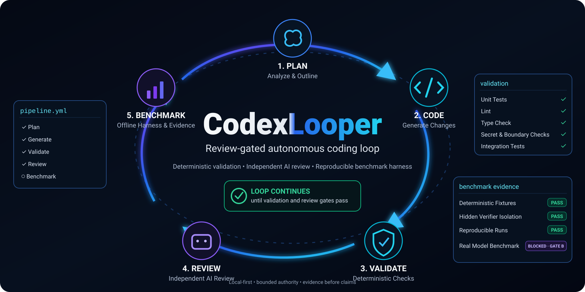

# CodexLooper

**A local, review-gated development loop for bounded autonomous coding work.**

<p align="center">
  
</p>

<p align="center">
  <a href="https://github.com/DatenpflegeNordHL/Codex-Looper/actions/workflows/ci.yml"></a>
  
  <a href="LICENSE"></a>
  <a href="CONTRIBUTING.md"></a>
  <a href="SECURITY.md"></a>
</p>

<p align="center">
  <a href="#bootstrap-a-target-project">Quick start</a> ·
  <a href="#what-it-can-do-today">Capabilities</a> ·
  <a href="#current-project-status">Status</a> ·
  <a href="docs/ROADMAP.md">Roadmap</a> ·
  <a href="SECURITY.md">Security</a> ·
  <a href="CONTRIBUTING.md">Contributing</a> ·
  <a href="#documentation">Docs</a>
</p>

CodexLooper connects project memory, roadmap execution, model-assisted implementation, deterministic validation, independent review and Git evidence in one controlled local workflow.

It is designed for teams and developers who want more automation than a single coding-agent prompt, without handing an AI unrestricted control over the repository or external systems.

## Why CodexLooper exists

Autonomous coding usually leaves humans moving context, patches, test results and review findings between several tools. CodexLooper turns that manual relay into a repeatable local pipeline:

```text
bounded plan
  -> MEX context selection
  -> Ralphex orchestration
  -> Terra implementation in a controlled snapshot
  -> host-controlled validation and patch application
  -> Sol independent review
  -> bounded repair loop
  -> local Git commit and evidence receipt
```

## What it can do today

- bootstrap a clean existing Git repository without overwriting owner-authored files;
- execute bounded implementation plans through a single local command;
- route selected project context through MEX instead of dumping the entire repository into every run;
- use Ralphex for roadmap execution, retries and review orchestration;
- use Terra as the default builder and Sol as a separate reviewer through CloseRouter;
- keep implementation work inside a read-only snapshot until a trusted host validates and applies the patch;
- run available syntax, test, build, secret and Git checks before accepting work;
- enforce allowed-path, runtime-integrity, budget and Git-authority boundaries;
- record model identity, usage, estimated cost, Git state and completion evidence without storing secrets or full model reasoning;
- validate deterministic offline benchmark fixtures through the completed WP8 Phase-A harness.

## What it deliberately does not do

CodexLooper does **not** automatically push, merge, deploy, publish, purchase, contact third parties or modify external accounts. Those actions require a separately authorised outer workflow.

Real model benchmark runs are also not active yet. The current benchmark work is building the contracts and isolation proof required before those runs are allowed.

## Current project status

| Area | Status |
| --- | --- |
| Core local CLI and hardened runner | Complete |
| Non-destructive target-project bootstrap | Complete |
| Terra implementation and Sol review loop | Complete |
| Token, cost and evidence receipts | Complete |
| Trust hardening and runtime boundaries | Complete |
| WP8 Phase A deterministic offline benchmark harness | Complete, merged in PR #17 |
| WP8 Phase B configuration and identity plan, B1a | Draft PR #20, independent re-review pending |
| Process-supervisor reliability fix | Complete, merged in PR #21 after an independent final `PASS`; the startup-synchronisation fix is verified by 212/212 tests |
| Real benchmark execution | Blocked until Gate B passes |
| Dashboard | Optional and deferred |

The project is intentionally progressing in small independently reviewed work packages. The older all-in-one Phase-B draft in PR #19 is closed and superseded; it remains historical architecture context and is not an implementation authority.

See [`docs/ROADMAP.md`](docs/ROADMAP.md) for the controlled sequence and evidence gates.

## Requirements

- Node.js 20 or newer;
- Git;
- Codex CLI;
- MEX;
- Ralphex;
- a configured CloseRouter path for authorised model calls.

Exact tool versions and supported combinations are verified by the repository checks and roadmap evidence rather than silently falling back to unknown versions.

## Bootstrap a target project

The target must be an existing clean Git repository.

```bash
node /path/to/codexlooper/scripts/bootstrap.mjs \
  --project /absolute/path/to/project \
  --real-codex "$(command -v codex)" \
  --mex-command "$(command -v mex)" \
  --ralphex-command "$(command -v ralphex)"
```

Review and commit the generated scaffold, then add a bounded plan under `docs/plans/` and run:

```bash
/path/to/project/.codexlooper/bin/codexlooper docs/plans/your-plan.md
```

## Development checks

```bash
npm run check
```

The current complete suite contains 212 tests on `main`. WP8 Phase A contributes 25 focused benchmark-harness tests.

## What the project needs next

The immediate need is reliability and proof, not more features:

1. revalidate B1a against the updated `main` and obtain an independent plan-review `PASS`;
2. merge and promote the B1a plan;
3. implement B1a configuration and identity contracts;
4. plan and implement B1b result schema and B1c deterministic scheduling;
5. continue through adapter, isolation, credential, telemetry, evidence and Gate-B proof work;
6. run real benchmark pilots only after every required boundary is technically demonstrated.

Useful contributions are reproducible bug reports, deterministic tests, portability findings for Node 20/22, documentation corrections and review of the currently authorised roadmap scope. New agents, providers or large features are intentionally deferred until the benchmark shows they are justified.

## Project principles

- Measure before expanding.
- Keep success criteria outside the model.
- Treat prompts, tools and model output as untrusted input.
- Prefer deterministic evidence over confident prose.
- Preserve negative benchmark results.
- Never weaken safety boundaries merely to make a test pass.

## Documentation

- [`PROJECT_SPEC.md`](PROJECT_SPEC.md) — goals, required behaviour and non-goals
- [`docs/ROADMAP.md`](docs/ROADMAP.md) — controlled roadmap and current execution order
- [`docs/architecture/CODEXLOOPER_LOOP_TRUST_INVARIANTS.md`](docs/architecture/CODEXLOOPER_LOOP_TRUST_INVARIANTS.md) — trust boundary
- [`CONTRIBUTING.md`](CONTRIBUTING.md) — contribution workflow
- [`SECURITY.md`](SECURITY.md) — vulnerability reporting

## License

Licensed under the Apache License 2.0. See [`LICENSE`](LICENSE).
